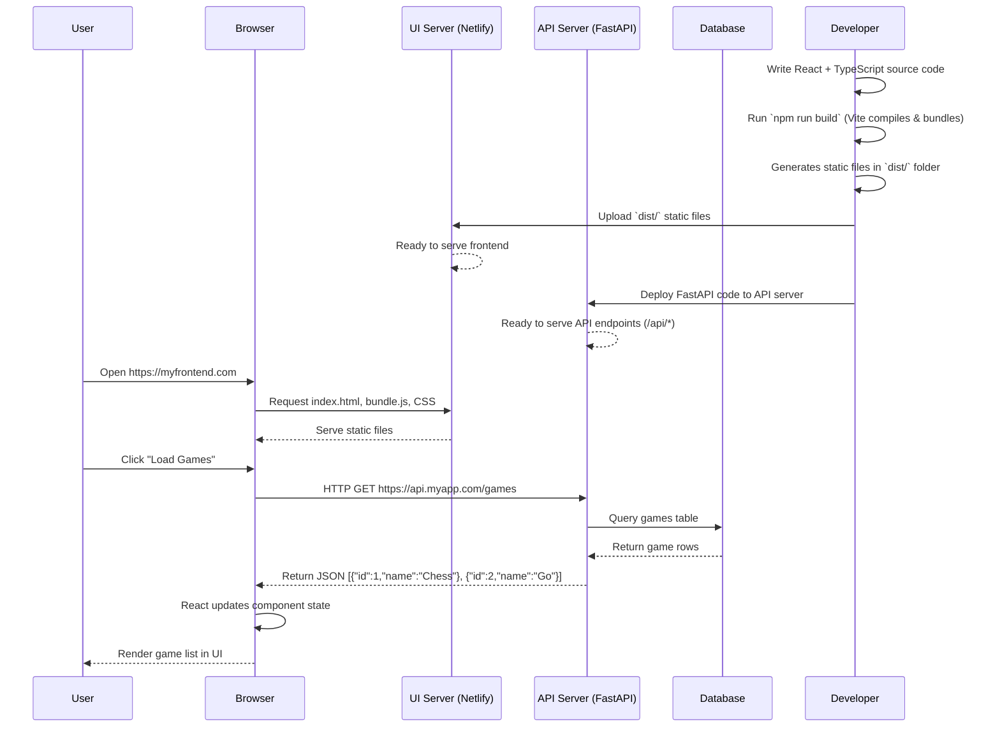

# chiron
fullstack developper course



# requirements

## Node

NodeJS installed with npm (node package manager)

```
npm --version
npm update npm -g
```

## Git
git installed 

```
git config --global core.autocrlf false
```

# frontend

React app, with typescript, and vite bundler.


```
npm create vite@latest ui -- --template react-ts
cd ui
npm install
npm run dev
```

## Material UI (mui)

Add material UI

```
npm install @mui/material @emotion/react @emotion/styled
```

### Launch UI

```
cd ui
npm run dev
```

## Hosting UI (Netlify)

Frontend will be deployed on netlify servers.µ

```
cd ui
npm install netlify-cli -g
netlify init
```

```
cd ui
netlify deploy
```

# Backend

## FastAPI

```
pip install "fastapi[standard]
```

You get:
- FastAPI (the framework itself)
- Uvicorn → the ASGI server to run your app
- Pydantic extra types (like email, IPvAnyAddress)
- python-multipart → needed if you handle form data / file uploads
- jinja2 → for server-side templates (if you render HTML)
- itsdangerous → useful for security, signing data

[standard] gives you a ready-to-go setup for most APIs and simple web apps.

### CORS configuration

Why do we need CORSMiddleware?
In order to make cross-origin requests (requests that originate from a different protocol, IP address, domain name, or port) you need to enable Cross Origin Resource Sharing (CORS).
FastAPI's built-in CORSMiddleware handles this for us.

```
from fastapi.middleware.cors import CORSMiddleware


app = FastAPI()

origins = [
    "http://localhost:5173",
    "localhost:5173"
]


app.add_middleware(
    CORSMiddleware,
    allow_origins=origins,
    allow_credentials=True,
    allow_methods=["*"],
    allow_headers=["*"]
)
```

The above configuration will allow cross-origin requests from our frontend domain and port which will run at localhost:5173.

### Launch API

```
cd api
fastapi dev main.py
```

### Hosting API (render)

We use the render website to host our API